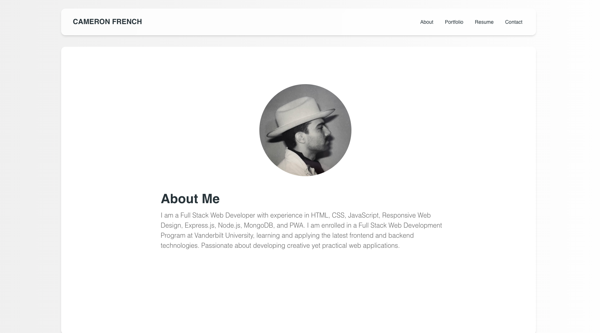

# React Portfolio
A web developer portfolio using React and Tailwind CSS. 

## Table of Contents
  - [Installation](#installation)
  - [Screenshots](#screenshots)
  - [Resources](#resources)
  - [Questions](#questions)

## Installation 
To install this application, do the following: 
 - Clone the repo to your local machine. 
 - Run "npm i" to install the dependencies. 
 - Run "npm run start" to start your application. 

## Screenshots
 

## Resources

[React](https://react.dev/)
[Tailwind-CSS](https://tailwindcss.com/)
[Material-Tailwind](https://www.material-tailwind.com/)

## Questions

If you have questions about this application, my contact information is below. 

Github Account: [cameronfrench](https://github.com/cameronfrench)

Email Address: [cameron.french92@gmail.com](mailto:cameron.french92@gmail.com)